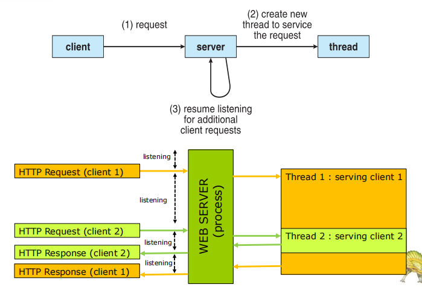
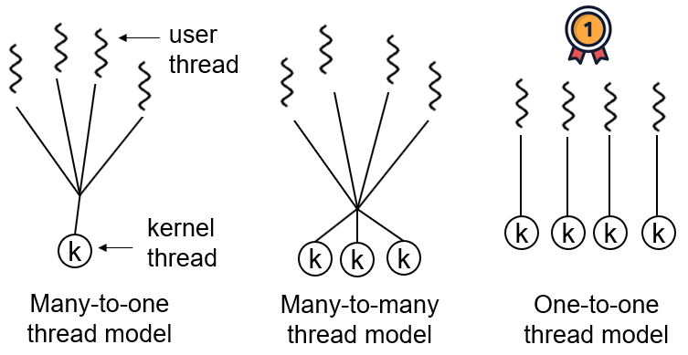
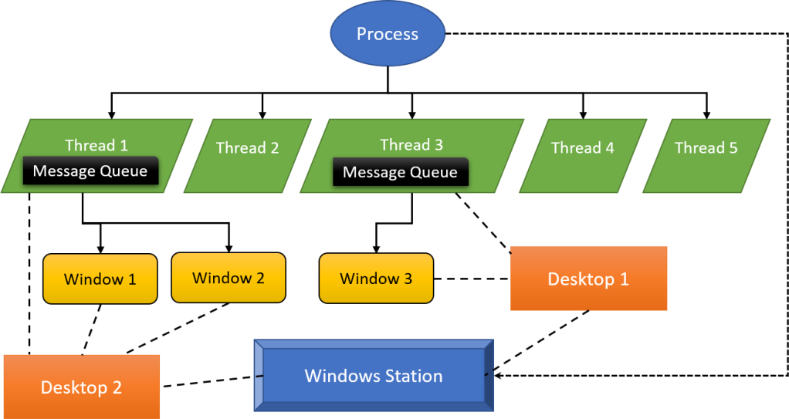
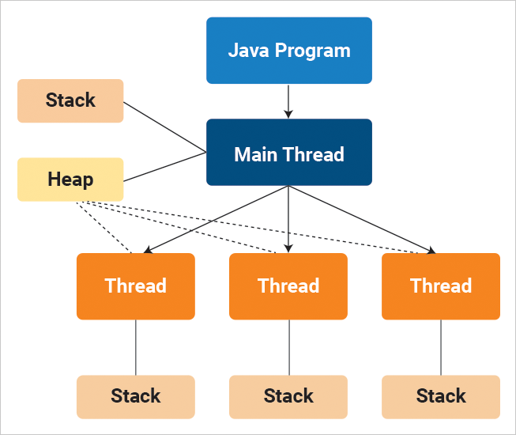
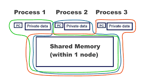

  <h1 style="text-align: center;font-weight: bold">Praktikum 10 Praktek Sistem Operasi</h1>
  <h4 style="text-align: center;">Dosen Pengampu : Dr. Ferry Astika Saputra, S.T., M.Sc.</h4>

 

  
  <h3 style="text-align: center;">Disusun Oleh : </h3>
  

    <strong>Mochammad Fahril Rizal (3123500013)</strong> 
  

<h3 style="text-align: center;line-height: 1.5">Politeknik Elektronika Negeri Surabaya Departemen Teknik Informatika Dan Komputer Program Studi Teknik Informatika 2023/2024</h3>
  

# Threads
Thread adalah unit dasar dari pemanfaatan CPU dan merupakan komponen penting dalam sistem komputer multithreaded. Setiap thread dalam sebuah proses berbagi sumber daya yang sama seperti memori dan file, tetapi memiliki register dan stack sendiri.

## Multithreaded Architecture

Arsitektur multithread adalah desain sistem komputer yang memungkinkan beberapa thread atau unit eksekusi berjalan secara simultan dalam satu proses atau aplikasi. Ini bertujuan untuk meningkatkan kinerja dan efisiensi dengan memanfaatkan kemampuan pemrosesan paralel dari CPU modern.

### Keuntungan Multithreaded Architecture
- Peningkatan Performa: Dengan menjalankan beberapa thread secara paralel, tugas-tugas dapat diselesaikan lebih cepat, terutama pada sistem dengan beberapa core atau CPU. Contoh: Aplikasi Pengolahan Gambar. Dalam aplikasi pengolahan gambar, seperti Adobe Photoshop, setiap operasi pengeditan dapat dibagi menjadi beberapa thread. Misalnya, saat menerapkan filter pada gambar beresolusi tinggi, setiap thread dapat memproses bagian yang berbeda dari gambar tersebut secara paralel. Ini mempercepat keseluruhan proses pengeditan karena pekerjaan dilakukan secara bersamaan.

- Efisiensi Sumber Daya: Thread lebih ringan daripada proses karena berbagi ruang alamat dan data, sehingga overhead switching (perpindahan) antara thread lebih kecil dibanding switching antar proses.

- Responsivitas: Dalam aplikasi interaktif, seperti antarmuka pengguna grafis (GUI), multithreading memungkinkan tugas berat seperti pemrosesan data dilakukan di latar belakang tanpa mengganggu interaksi pengguna.

- Pemanfaatan Optimal Multi-core CPU: Dalam tugas pemrosesan data besar, seperti data mining atau analisis statistik pada dataset besar, pembagian tugas ke beberapa thread memungkinkan setiap core pada CPU multi-core digunakan secara maksimal. Misalnya, Apache Spark memanfaatkan multithreading untuk memproses data dalam cluster, membagi tugas ke beberapa node dan thread untuk meningkatkan throughput dan mempercepat analisis data.

## Multicore Programming
Multicore programming adalah pendekatan pemrograman yang dirancang untuk memanfaatkan prosesor dengan beberapa inti (core). Dengan multicore, satu prosesor dapat memiliki beberapa unit pemrosesan independen yang dapat menjalankan tugas secara paralel, meningkatkan efisiensi dan kinerja aplikasi. Multicore atau sistem multiprocessor memberikan tekanan pada pemrogram, tantangannya meliputi:

- Dividing activities
  - Tantangan: Menentukan bagaimana membagi program menjadi unit-unit yang lebih kecil yang dapat dijalankan secara simultan tanpa menyebabkan overhead yang signifikan. Beberapa bagian program mungkin tidak bisa dipecah atau tidak efektif jika dijalankan secara paralel.

  - Contoh: Dalam pemrosesan gambar, filter dapat diterapkan ke bagian-bagian gambar secara paralel, tetapi operasi yang memerlukan seluruh gambar mungkin lebih sulit untuk dipecah.

- Balance
  - Tantangan: Menghindari situasi di mana beberapa core sibuk sementara yang lain menganggur. Load balancing yang buruk bisa mengakibatkan efisiensi rendah dan waktu pemrosesan lebih lama.
  - Contoh: Pada server web, memastikan bahwa semua thread yang melayani permintaan klien memiliki jumlah pekerjaan yang seimbang agar tidak ada core yang terlalu banyak atau terlalu sedikit bekerja.

- Data splitting
  - Tantangan: Menentukan cara membagi data agar setiap core dapat memproses bagian datanya sendiri tanpa konflik dan dengan minimal komunikasi antar core.
  - Contoh: Pada sistem basis data terdistribusi, tabel besar dapat dibagi menjadi beberapa segmen yang masing-masing diurus oleh core yang berbeda.

- Data dependency
  - Tantangan: Menghindari masalah konsistensi dan sinkronisasi yang disebabkan oleh ketergantungan data, seperti kondisi balapan (race conditions), deadlock, dan masalah memori bersama.
  - Contoh: Pada aplikasi simulasi fisika, perhitungan posisi objek berikutnya mungkin bergantung pada posisi dan kecepatan saat ini, sehingga perlu sinkronisasi yang tepat agar hasilnya akurat.

- Testing and debugging
  - Tantangan: Debugging dan testing aplikasi paralel lebih kompleks dibandingkan aplikasi serial karena interaksi antara thread atau proses bisa sulit diprediksi dan direproduksi. Masalah yang timbul mungkin hanya terjadi dalam kondisi persaingan tertentu yang sulit dilacak.
  - Contoh: Dalam aplikasi finansial yang melakukan transaksi simultan, bug terkait konsistensi data bisa sangat sulit ditemukan dan diperbaiki karena mungkin terjadi hanya di bawah kondisi persaingan tertentu.

### Parallelism dan Concurrency
Parallelism dan concurrency adalah dua konsep penting dalam pemrograman dan komputasi yang sering kali dianggap sama, tetapi sebenarnya memiliki perbedaan mendasar.

- Parallelism (Paralelisme)
Paralelisme adalah teknik di mana beberapa proses atau thread dijalankan secara simultan dengan tujuan untuk meningkatkan kinerja dan efisiensi eksekusi program. Ini dilakukan dengan memanfaatkan beberapa core atau prosesor dalam sistem komputer untuk menjalankan tugas-tugas secara bersamaan.
  - Contoh: Dalam pemrosesan gambar, setiap bagian dari gambar dapat diproses secara paralel oleh core yang berbeda, sehingga seluruh gambar dapat diproses lebih cepat.
  - Penggunaan: Digunakan dalam konteks tugas-tugas yang dapat dipecah menjadi bagian-bagian independen yang dapat dieksekusi secara bersamaan, seperti dalam komputasi ilmiah, render grafis, dan analisis data besar.

- Concurrency (Konkuren)
Concurrency adalah teknik di mana beberapa tugas diatur sedemikian rupa sehingga dapat membuat kemajuan pada waktu yang sama, tetapi tidak harus dijalankan secara simultan. Ini melibatkan pengelolaan waktu dan sumber daya untuk menjalankan beberapa tugas yang mungkin saling berbagi.
  - Contoh: Dalam aplikasi web server, beberapa permintaan klien dapat dilayani secara bersamaan dengan membagi waktu CPU di antara thread yang berbeda, sehingga semua permintaan diproses dalam waktu yang wajar.
  - Penggunaan: Digunakan dalam konteks di mana banyak tugas harus dilakukan secara bersamaan tetapi tidak harus diselesaikan pada saat yang sama, seperti dalam pemrograman GUI, sistem operasi, dan aplikasi real-time.

| Aspek          | Parallelism                               | Concurrency                                |
|----------------|-------------------------------------------|--------------------------------------------|
| **Definisi**   | Eksekusi simultan dari beberapa tugas     | Pengelolaan beberapa tugas yang tampak berjalan bersamaan |
| **Fokus**      | Melakukan banyak tugas pada saat yang sama | Mengatur banyak tugas agar dapat membuat kemajuan bersama |
| **Tujuan**     | Mempercepat waktu eksekusi tugas          | Memastikan kelangsungan dan responsivitas tugas |
| **Contoh**     | Pemrosesan data besar, render grafis      | Aplikasi web server, pemrograman GUI       |
| **Eksekusi**   | Memanfaatkan banyak core/prosesor         | Tidak harus menggunakan banyak core/prosesor |
| **Implementasi** | Tugas-tugas yang dapat dipecah menjadi bagian independen | Tugas-tugas yang memerlukan koordinasi dan sinkronisasi |

## Multithreading Models

- Many-to-One: Banyak thread pengguna dipetakan ke satu thread kernel. Model ini tidak mendukung paralelisme pada sistem multicore karena hanya satu thread yang dapat berjalan di kernel pada satu waktu.
- Many-to-Many: Banyak thread pengguna dipetakan ke banyak thread kernel. Model ini memungkinkan lebih fleksibel dan efisien dalam mengelola thread.
- One-to-One: Setiap thread pengguna dipetakan ke satu thread kernel. Model ini mendukung paralelisme tetapi bisa mahal karena setiap thread pengguna membutuhkan thread kernel.

## User Threads dan Kernel Threads
- User Threads
User threads adalah thread yang dikelola di level aplikasi oleh pustaka atau runtime sistem, tanpa interaksi langsung dengan kernel. Manajemen user threads dilakukan sepenuhnya oleh program pengguna atau pustaka pengguna.

- Kernel Threads
Kernel threads adalah thread yang dikelola langsung oleh kernel sistem operasi. Kernel bertanggung jawab untuk penjadwalan, manajemen, dan pengalihan konteks antara kernel threads.

| Aspek           | User Threads                                     | Kernel Threads                                   |
|-----------------|--------------------------------------------------|--------------------------------------------------|
| **Definisi**    | Thread yang dikelola di level aplikasi           | Thread yang dikelola oleh kernel                 |
| **Manajemen**   | Dikelola oleh pustaka atau runtime di pengguna   | Dikelola oleh kernel                             |
| **Efisiensi**   | Lebih cepat dalam pembuatan dan pengelolaan      | Lebih lambat karena melibatkan kernel            |
| **Portabilitas**| Lebih mudah dipindahkan antar sistem operasi     | Tergantung pada fitur spesifik kernel            |
| **Dukungan Multicore** | Tidak bisa memanfaatkan multikore secara langsung | Dapat memanfaatkan multikore secara penuh       |
| **Blocking**    | Operasi blocking dapat memblokir seluruh proses  | Operasi blocking hanya memblokir thread yang bersangkutan |
| **Overhead**    | Rendah, karena tidak melibatkan kernel           | Tinggi, karena melibatkan kernel                 |
| **Contoh Implementasi** | Green threads, Pustaka POSIX Pthreads di level pengguna | Windows threads, NPTL di Linux, Solaris threads |

## Threads Library
Thread library merupakan alat penting dalam pengembangan aplikasi multithreaded, menyediakan fungsi dan mekanisme untuk mempermudah pembuatan, manajemen, dan sinkronisasi thread. Dengan menggunakan thread library, pemrogram dapat menulis kode yang lebih efisien dan portabel, serta memanfaatkan kemampuan perangkat keras modern yang mendukung eksekusi paralel. Contoh Implementasi Thread Library

### POSIX Threads (pthreads):

Standar pustaka thread yang banyak digunakan di berbagai sistem operasi berbasis Unix. Menyediakan berbagai fungsi untuk pembuatan dan manajemen thread, sinkronisasi, dan pengelolaan data thread-spesifik.
- Contoh fungsi: *pthread_create*, *pthread_join*, *pthread_mutex_lock*, *pthread_cond_wait*.

### Windows Threads:

API thread yang disediakan oleh Windows untuk membuat dan mengelola thread di lingkungan Windows.
- Contoh fungsi: *CreateThread*, *WaitForSingleObject*, *EnterCriticalSection*, *LeaveCriticalSection*.

### Java Threads:

Bagian dari Java Standard Library, memungkinkan pembuatan dan manajemen thread di Java.
Menggunakan kelas *Thread* dan interface *Runnable*.
- Contoh: `Thread t = new Thread(new RunnableTask()); t.start();`.

### OpenMP:

Pustaka untuk pemrograman paralel yang menggunakan model shared memory.
Menggunakan direktif yang disematkan dalam kode sumber (biasanya C, C++, atau Fortran) untuk menunjukkan bagian mana yang harus dijalankan secara paralel.
- Contoh: #pragma omp parallel.

## Thread Implisit
Thread implisit mengacu pada penggunaan thread tanpa interaksi langsung atau eksplisit dari pengembang. Dalam beberapa kasus, bahasa pemrograman atau lingkungan runtime menggunakan thread secara implisit untuk menjalankan tugas-tugas tertentu tanpa perlu campur tangan pengguna. Berikut adalah beberapa contoh metode yang menggunakan thread implisit:
1. Thread Pool
- Dalam beberapa framework atau pustaka, seperti Java's Executor framework, ada thread pool yang digunakan untuk menjalankan tugas-tugas secara konkuren. Pengembang dapat mengirimkan tugas ke thread pool, dan thread yang tersedia dalam pool akan mengeksekusi tugas tersebut secara implisit.
- Keuntungan
  - Pengelolaan Sumber Daya: Thread pool memungkinkan pengelolaan sumber daya yang lebih efisien dengan menghindari pembuatan dan penghancuran thread secara berulang. Thread yang dibuat di awal akan tetap ada dalam pool dan digunakan kembali untuk menangani tugas-tugas yang masuk.

  - Kontrol Beban: Thread pool memungkinkan kontrol yang lebih baik atas beban kerja dengan membatasi jumlah thread yang tersedia. Ini mencegah pembuatan terlalu banyak thread yang dapat mengakibatkan overhead.

  - Responsivitas: Dengan thread pool, thread yang tersedia dapat segera menangani tugas yang masuk tanpa harus menunggu pembuatan thread baru, meningkatkan responsivitas aplikasi.

- Implementasi
Thread pool dapat diimplementasikan menggunakan pustaka atau framework khusus yang menyediakan fungsionalitas thread pool, seperti:

  - Java Executor Framework: Java menyediakan Executor framework yang dapat digunakan untuk membuat dan mengelola thread pool dengan berbagai jenis executor, seperti ThreadPoolExecutor.

  - C++ Thread Pool Libraries: Ada berbagai pustaka C++ yang menyediakan thread pool, seperti Boost.Thread atau ThreadPool di C++11.

2. OpenMP
- OpenMP (Open Multi-Processing) adalah sebuah API untuk pemrograman paralel yang digunakan terutama dalam bahasa pemrograman C, C++, dan Fortran. OpenMP menyediakan cara untuk menambahkan paralelisme ke dalam program dengan cara yang mudah dan portabel.

- Keuntungan
  - Kemudahan Penggunaan: OpenMP menyediakan model pemrograman paralel yang relatif mudah digunakan, dengan menggunakan direktif pragma dan fungsi-fungsi bawaan untuk mengelola paralelisme.

  - Portabilitas: Kode yang menggunakan OpenMP dapat lebih mudah dipindahkan antar platform karena dukungan yang luas dari berbagai kompilator dan sistem operasi.

  - Skalabilitas: OpenMP secara otomatis dapat menyesuaikan jumlah thread yang digunakan sesuai dengan jumlah core yang tersedia pada sistem, sehingga meningkatkan kinerja aplikasi.

- Implementasi
OpenMP dapat diimplementasikan dalam bahasa pemrograman C, C++, dan Fortran. Penggunaan OpenMP melibatkan penambahan direktif pragma ke dalam kode sumber untuk menandai bagian yang akan dieksekusi secara paralel.

3. Grand Central Dispatch (GCD)
- Grand Central Dispatch (GCD) adalah sebuah teknologi penjadwalan yang dikembangkan oleh Apple untuk mengelola konkurensi dalam aplikasi yang berjalan di platform macOS, iOS, dan tvOS.

- Keuntungan
  - Penjadwalan Dinamis: Grand Central Dispatch (GCD) memungkinkan penjadwalan tugas secara dinamis pada thread yang tersedia, sehingga meningkatkan penggunaan sumber daya.

  - Abstraksi yang Kuat: GCD menyediakan abstraksi tingkat tinggi untuk mengelola concurrency dan paralelisme, sehingga memudahkan pengembangan aplikasi yang efisien dan responsif.

  - Dukungan untuk Berbagai Platform: GCD tersedia di macOS, iOS, dan beberapa sistem operasi lainnya, sehingga memungkinkan pengembangan aplikasi dengan dukungan paralelisme yang konsisten di berbagai platform.

- Implementasi
Grand Central Dispatch dapat diimplementasikan dalam aplikasi yang ditargetkan untuk platform Apple, seperti macOS dan iOS, dengan menggunakan API yang disediakan oleh Apple.

## Threading Issues
Threading issues adalah masalah-masalah yang muncul ketika pengembang bekerja dengan thread dalam pengembangan perangkat lunak. Penggunaan thread dapat memperkenalkan sejumlah masalah yang kompleks dan sulit untuk diatasi. Berikut adalah beberapa threading issues yang umum terjadi:
1. Semantics of fork() and exec() System Calls
- fork(): Sistem panggilan fork() digunakan untuk membuat proses baru yang merupakan salinan identik dari proses pemanggil. Setelah pemanggilan fork(), dua proses yang berbeda tetapi serupa secara terpisah berjalan secara paralel. Proses yang baru diciptakan disebut sebagai proses anak, sementara proses yang memanggil fork() disebut sebagai proses induk.

- exec(): Sistem panggilan exec() digunakan untuk menggantikan memori dan ruang proses dari proses saat ini dengan program baru. Ini secara efektif menggantikan isi memori dan kode proses saat ini dengan program baru yang akan dijalankan. Beberapa varian exec() seperti execl(), execv(), dll. memungkinkan untuk menentukan cara program baru dan argumennya.

2. Signal Handling
- Signal Handling: Sinyal adalah pesan yang dikirim oleh kernel atau proses lain untuk memberi tahu proses bahwa sebuah peristiwa telah terjadi. Sistem operasi memberikan kemampuan kepada proses untuk menangkap dan menanggapi sinyal ini. Signal handling melibatkan pendaftaran fungsi penangan sinyal yang akan dipanggil ketika sinyal tertentu diterima oleh proses.

- Penanganan Sinyal: Proses dapat menangkap sinyal tertentu dengan mengatur handler khusus untuk sinyal tersebut. Handler ini akan dipanggil saat sinyal terkait diterima. Contoh sinyal termasuk SIGINT (Ctrl+C), SIGSEGV (segmentation fault), dan SIGTERM (terminate).

3. Thread Cancellation
- Thread cancellation adalah proses menghentikan eksekusi thread sebelum selesai dengan cara yang terkontrol. Ini bisa menjadi pembatalan asinkronus, di mana thread dibatalkan secara tiba-tiba oleh thread lain, atau pembatalan yang diminta, di mana thread meminta untuk dibatalkan dengan menggunakan flag atau fungsi tertentu.

4. Thread-local Storage (TLS):
- Thread-local storage adalah mekanisme yang memungkinkan setiap thread dalam proses untuk memiliki salinan data yang independen dan terisolasi. Data di thread-local storage hanya dapat diakses oleh thread yang memilikinya, dan perubahan di satu thread tidak memengaruhi data di thread lain.

- Implementasi: Thread-local storage dapat diimplementasikan menggunakan variabel statis dengan kualifier thread_local atau menggunakan fungsi sistem operasi untuk alokasi memori thread-local.

5. Scheduler Activations
- Scheduler activations adalah teknik yang digunakan dalam manajemen thread untuk meningkatkan performa multitasking dalam sistem operasi. Ini memungkinkan kernel untuk berinteraksi dengan thread secara langsung, tanpa melibatkan pengalihan ke mode kernel.

- Implementasi: Beberapa sistem operasi seperti FreeBSD menggunakan scheduler activations untuk meningkatkan performa dan responsivitas sistem dalam menangani thread.

# Pertanyaan
1. Jelaskan perbedaan antara thread blocking dan non-blocking!

Jawab:

• Thread blocking: Thread blocking adalah thread yang dihentikan sementara karena menunggu suatu peristiwa terjadi, seperti I/O selesai atau sumber daya yang dibutuhkan tersedia. Ketika thread blocking, thread tersebut tidak dapat menggunakan CPU dan sumber daya lainnya.

• Thread non-blocking: Thread non-blocking adalah thread yang dapat terus berjalan meskipun sedang menunggu suatu peristiwa terjadi. Thread non-blocking biasanya menggunakan teknik polling atau callback untuk memeriksa status peristiwa secara berkala.

2. Apa saja keuntungan dan kekurangan menggunakan thread blocking dan thread non-blocking?

Jawab:

Thread blocking

Keuntungan:

• Lebih mudah untuk diprogram karena programmer tidak perlu khawatir tentang sinkronisasi antar thread

• Dapat membantu meningkatkan kinerja program dengan memungkinkan beberapa tugas dijalankan secara simultan

Kekurangan:

• Dapat menyebabkan deadlock jika dua atau lebih thread saling menunggu satu sama lain untuk menyelesaikan tugasnya

• Dapat menyebabkan livelock jika dua atau lebih thread terus menerus bertukar sumber daya, tetapi tidak ada yang dapat menyelesaikan tugasnya

Thread non-blocking

Keuntungan:

• Dapat membantu meningkatkan responsivitas program dengan memungkinkan pengguna untuk berinteraksi dengan program sambil tugas lain masih diproses

• Dapat membantu menghindari deadlock dan livelock

Kekurangan:

• Lebih sulit untuk diprogram karena programmer perlu mempertimbangkan sinkronisasi antar thread

• Dapat menyebabkan overhead performa yang lebih tinggi karena thread non-blocking perlu memeriksa status peristiwa secara berkala

3. Jelaskan bagaimana sistem operasi menjadwalkan thread!

Jawab:

Sistem operasi menjadwalkan thread dengan menggunakan algoritma penjadwalan. Algoritma penjadwalan menentukan thread mana yang akan dijalankan pada CPU pada waktu tertentu. Ada banyak algoritma penjadwalan yang berbeda, seperti:

• Penjadwalan round-robin: Algoritma round-robin menjadwalkan thread dalam urutan melingkar, memberikan setiap thread jumlah waktu CPU yang sama

• Penjadwalan prioritas: Algoritma prioritas menjadwalkan thread berdasarkan prioritasnya, dengan thread yang memiliki prioritas lebih tinggi dijalankan terlebih dahulu

• Penjadwalan multilevel feedback: Algoritma multilevel feedback membagi thread ke dalam beberapa kelas prioritas dan menjadwalkan thread dalam setiap kelas dengan menggunakan algoritma penjadwalan yang berbeda

4. Apa saja faktor yang dapat memengaruhi kinerja program multi-threaded?

Jawab:

Ada banyak faktor yang dapat memengaruhi kinerja program multi-threaded, seperti:

• Jumlah thread: Semakin banyak thread yang digunakan, semakin tinggi overhead performa program

• Sinkronisasi: Mekanisme sinkronisasi dapat menyebabkan overhead performa, terutama jika thread sering mengakses sumber daya yang sama

• Penjadwalan: Algoritma penjadwalan yang digunakan dapat memengaruhi kinerja program

• Beban kerja: Jenis tugas yang dijalankan oleh thread dapat memengaruhi kinerja program

5. Apa saja mekanisme sinkronisasi yang digunakan dalam thread?

Jawab:

Mekanisme sinkronisasi digunakan untuk memastikan bahwa thread yang berbeda mengakses data dan sumber daya secara aman dan terkoordinasi. Beberapa mekanisme sinkronisasi yang umum digunakan adalah:

• Mutex: Mutex (mutual exclusion) adalah kunci yang hanya dapat dimiliki oleh satu thread pada satu waktu

• Semaphore: Semaphore adalah variabel yang nilainya dapat digunakan untuk membatasi jumlah thread yang dapat mengakses sumber daya tertentu

• Condition variable: Condition variable adalah variabel yang dapat digunakan untuk mensinkronisasi thread yang menunggu peristiwa tertentu terjadi

6. Apa saja masalah yang dapat terjadi dalam pemrograman multi-thread?

Jawab:

Beberapa masalah yang dapat terjadi dalam pemrograman multi-thread adalah:

• Deadlock: Deadlock adalah situasi di mana dua atau lebih thread saling menunggu satu sama lain untuk menyelesaikan tugasnya, sehingga tidak ada thread yang dapat melanjutkan

• Race condition: Race condition adalah situasi di mana hasil suatu program bergantung pada urutan eksekusi thread

• Livelock: Livelock adalah situasi di mana dua atau lebih thread terus menerus bertukar sumber daya, tetapi tidak ada yang dapat menyelesaikan tugasnya

# Referensi
- https://www.geeksforgeeks.org/thread-in-operating-system/
- https://www.geeksforgeeks.org/benefits-of-multithreading-in-operating-system/
- https://www.geeksforgeeks.org/threading-issues/
- https://www.geeksforgeeks.org/difference-between-user-level-thread-and-kernel-level-thread/
- https://medium.com/@yovan/os-process-thread-user-kernel-%E7%AD%86%E8%A8%98-aa6e04d35002