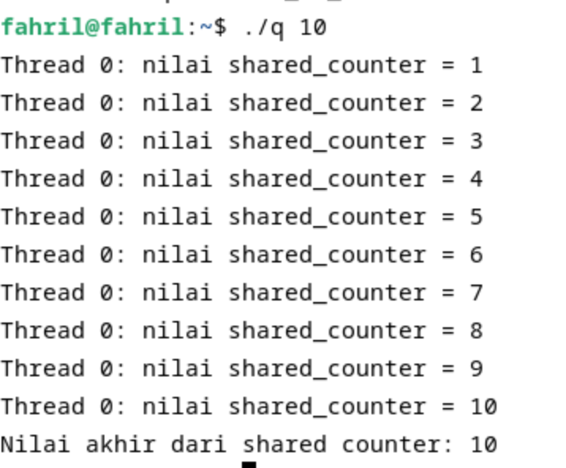
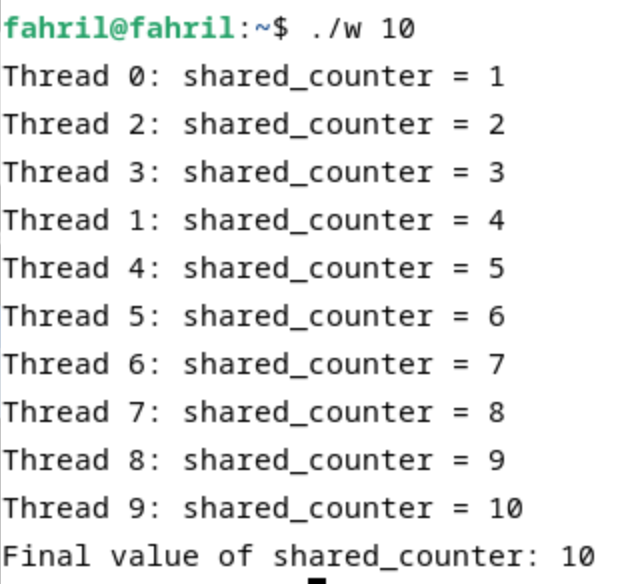

<div align="center">
  <h1 style="text-align: center;font-weight: bold">Praktikum 12<br>Mutex</h1>
  <h4 style="text-align: center;">Dosen Pengampu : Dr. Ferry Astika Saputra, S.T., M.Sc.</h4>
</div>
<br />
<div align="center">
  
  <h3 style="text-align: center;">Disusun Oleh : </h3>
  <p style="text-align: center;">
    <strong>Mochammad Fahril Rizal (3123500013)</strong><br>
  </p>
<h3 style="text-align: center;line-height: 1.5">Politeknik Elektronika Negeri Surabaya<br>Departemen Teknik Informatika Dan Komputer<br>Program Studi Teknik Informatika<br>2023/2024</h3>
  <hr><hr>
</div>

# POSIX
POSIX (Portable Operating System Interface) adalah sekumpulan standar yang ditetapkan oleh IEEE (Institute of Electrical and Electronics Engineers) untuk menjaga kompatibilitas antara sistem operasi. POSIX dirancang untuk memungkinkan aplikasi perangkat lunak yang dikembangkan di satu jenis sistem operasi untuk berjalan di jenis sistem operasi lainnya tanpa perubahan yang signifikan. Standar ini terutama berlaku untuk sistem operasi yang mirip Unix.

## Kode dari soal 2
```
// beri komentar
#include <pthread.h>
#include <stdio.h>
#include <stdlib.h>

// Global variable
int shared_counter = 0;

// beri komentar
void *thread_function(void *thread_id)
{
    //menginisiasi threat
    pthread_t tid = (pthread_t)thread_id;

    // Increment global var
    shared_counter++;

    // beri komentar
    printf("Thread %ld: nilai shared_counter = %d\n", (long)tid,
           shared_counter);

    // beri komentar
    return NULL;
}

int main(int argc, char *argv[])
{
    // beri komentar
    if (argc != 2)
    {
        printf("Gunakan: %s <number_of_threads>\n", argv[0]);
        exit(EXIT_FAILURE);
    }
    // mengambil nilai masukan jumlha dari thread melalui argumen
    int num_threads = atoi(argv[1]);

    // beri komentar
    pthread_t *threads = (pthread_t *)malloc(
        num_threads * sizeof(pthread_t));

    // membuat threads
    for (int i = 0; i < num_threads; i++)
    {
        int status = pthread_create(&threads[i], NULL,
                                    thread_function,
                                    (void *)threads[i]);
        if (status != 0)
        {
            printf("Error: pthread_create() returned error "
                   "code %d\n",
                   status);
            exit(EXIT_FAILURE);
        }
    }

    // Wait for all threads to finish execution
    for (int i = 0; i < num_threads; i++)
    {
        int status = pthread_join(threads[i], NULL);
        if (status != 0)
        {
            printf("Error: pthread_join() returned error "
                   "code %d\n",
                   status);
            exit(EXIT_FAILURE);
        }
    }

    // Free the memory allocated for the thread IDs
    free(threads);

    // Print the final value of the shared counter
    printf("Nilai akhir dari shared counter: %d\n",
           shared_counter);

    // Return success
    return 0;
}
```

### ANALISIS KODE
- Program diatas menggunakan thread untuk melakukan operasi penambahan pada variabel global
shared_counter.
- Fungsi thread_function digunakan oleh setiap thread untuk menambahkan nilai shared_counter dan
menampilkan nilai yang baru.
- Pada fungsi main, program menerima argumen baris perintah berupa jumlah thread yang ingin dibuat.
- Setelah membuat semua thread, program menunggu semua thread selesai dieksekusi sebelum
melanjutkan.
- Setelah semua thread selesai dieksekusi, nilai akhir dari shared_counter ditampilkan. 

# MUTEX
Mutex (Mutual Exclusion) adalah mekanisme sinkronisasi yang digunakan dalam pemrograman untuk memastikan bahwa hanya satu thread atau proses yang dapat mengakses sumber daya kritis tertentu pada satu waktu. Sumber daya kritis ini bisa berupa variabel, data, atau bagian dari kode yang tidak boleh diakses secara bersamaan oleh lebih dari satu thread karena dapat menyebabkan kondisi balapan (race condition) atau inkonsistensi data.

## Kode dari soal 2
```
#include <pthread.h>
#include <stdio.h>
#include <stdlib.h>

int shared_counter = 0;
pthread_mutex_t shared_counter_mutex = PTHREAD_MUTEX_INITIALIZER;

void *thread_function(void *thread_id) {
    long tid = (long)thread_id;
    pthread_mutex_lock(&shared_counter_mutex);
    shared_counter++;
    printf("Thread %ld: shared_counter = %d\n", tid, shared_counter);
    pthread_mutex_unlock(&shared_counter_mutex);
    return NULL;
}

int main(int argc, char *argv[]) {
    if (argc != 2) {
        printf("Usage: %s <number_of_threads>\n", argv[0]);
        exit(EXIT_FAILURE);
    }

    int num_threads = atoi(argv[1]);
    pthread_t *threads = (pthread_t *)malloc(num_threads * sizeof(pthread_t));
    if (threads == NULL) {
        printf("Error: Memory allocation failed\n");
        exit(EXIT_FAILURE);
    }

    for (long i = 0; i < num_threads; i++) {
        int status = pthread_create(&threads[i], NULL, thread_function, (void *)i);
        if (status != 0) {
            printf("Error: pthread_create() returned error code %d\n", status);
            exit(EXIT_FAILURE);
        }
    }

    for (int i = 0; i < num_threads; i++) {
        int status = pthread_join(threads[i], NULL);
        if (status != 0) {
            printf("Error: pthread_join() returned error code %d\n", status);
            exit(EXIT_FAILURE);
        }
    }

    free(threads);
    printf("Final value of shared_counter: %d\n", shared_counter);
    return 0;
}
```

### ANALISIS KODE
- Program diatas menggunakan mutex untuk mengamankan akses ke variabel global shared_counter.
- Mutex digunakan untuk mengunci (lock) akses ke shared_counter sebelum variabel digunakan dan
membuka kunci (unlock) setelah selesai digunakan.
Dengan demikian, hanya satu thread yang diizinkan untuk mengakses dan memodifikasi shared_counter
pada satu waktu.
Ini menghilangkan kondisi balapan (race condition) dan memastikan bahwa operasi penambahan
shared_counter dilakukan dengan benar dan nilai shared_counter konsisten di antara thread-thread yang
berjalan secara bersamaan.Karena penggunaan mutex, hasilnya akan lebih konsisten dan dapat
diprediksi, dan tidak akan terjadi kegagalan yang tidak terduga karena akses bersama ke
shared_counter

## KESIMPULAN
Kedua kode diatas merupakan contoh penggunaan threading dalam bahasa pemrograman C menggunakan POSIX Threads (pthread).Tetapi untuk kode kedua menambahkan fungsi mutex untuk menghindari race condition. Perbedaan utama di antara keduanya adalah penggunaan mutex di kode kedua untuk mengamankan akses ke variabel global shared_counter, sementara kode pertama tidak. Dengan penggunaan mutex, kode kedua memastikan bahwa operasi penambahan terhadap shared_counter dilakukan dengan benar dan konsisten di antara semua thread yang berjalan secara bersamaan, menghindari race condition yang dapat terjadi dalam kode pertama. 