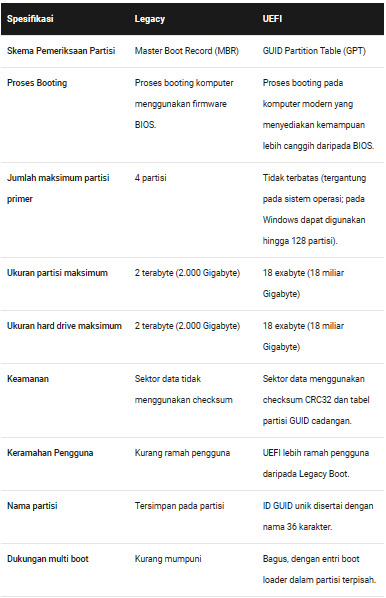

  <h1 style="text-align: center;font-weight: bold">Praktikum 2 SysOp Perbedaan Legacy & UEFI</h1>
  <h4 style="text-align: center;">Dosen Pengampu : Dr. Ferry Astika Saputra, S.T., M.Sc.</h4>

 

  
  <h3 style="text-align: center;">Disusun Oleh : </h3>
  

    <strong>Mochammad Fahril Rizal (3123500013)</strong> 
    <strong>Adrian Yoga Chrisarianto (3123500021)</strong> 
    <strong>Muhammad Arief Wicaksono Putra Santoso (3122500022)</strong>
  

<h3 style="text-align: center;line-height: 1.5">Politeknik Elektronika Negeri Surabaya Departemen Teknik Informatika Dan Komputer Program Studi Teknik Informatika 2023/2024</h3>
  

## Daftar Isi
- [About Bios](#about-bios)
- [Penjelasan Legacy](#penjelasan-legacy)
- [Penjelasan UEFI](#penjelasan-uefi)
- [SOAL](#soal)
    - [1. Perbedaan UEFI dengan Legacy](#1-perbedaan-uefi-dengan-legacy)
- [Penutup](#penutup)
  - [Referensi](#referensi)

# About Bios
BIOS adalah singkatan dari Basic Input/Output System. Ini adalah perangkat lunak yang terletak di dalam sebuah komputer yang bertanggung jawab untuk menginisialisasi perangkat keras saat komputer dinyalakan. BIOS berfungsi sebagai antarmuka antara sistem operasi dan perangkat keras komputer. Tugas utama BIOS meliputi pengujian awal perangkat keras (POST), menginisialisasi perangkat keras seperti prosesor, RAM, dan kartu grafis, serta memuat sistem operasi dari media penyimpanan seperti hard drive atau USB.   
 BIOS juga memungkinkan pengguna untuk mengonfigurasi pengaturan dasar sistem, seperti waktu dan tanggal sistem, urutan boot, dan konfigurasi perangkat keras lainnya. Meskipun BIOS telah digantikan oleh standar baru yang disebut UEFI (Unified Extensible Firmware Interface) dalam beberapa komputer modern, istilah "BIOS" masih sering digunakan secara umum untuk merujuk pada perangkat lunak yang melakukan fungsi yang sama.   
 Ada 2 Jenis BIOS Mode :  
 -Legacy Mode  
 -UEFI Mode   

 # Penjelasan Legacy
 Legacy BIOS adalah proses boot yang digunakan oleh firmware BIOS. Legacy ini akan menyimpan daftar perangkat penyimpanan yang dapat di boot meliputi Floopy Disk Drives, Hard Disk Drives, Optical Disk Drives, dan sebagainya. Ketika Anda menyalakan komputer, BIOS akan melakukan Power On Self-Test (POST), kemudian sebuah speaker dari sistem internal mengeluarkan bunyi bip pendek sekali untuk menunjukkan bahwa booting berjalan normal. Bunyi bip ini membantu untuk mengidentifikasi kode dan dapat bertindak untuk memecahkan masalah lanjutan.  
 Setelah proses POST selesai, firmware akan memuat sektor pertama dari setiap target perangkat penyimpanan ke dalam memori. Firmware di sini juga memindai MBR (Master Boot Record) yang valid. Setelah ditemukan MBR yang valid, maka firmware akan melanjutkan eksekusi ke bootloader untuk pemilihan partisi tempat booting. Ketika salah satu bagian valid tidak ditemukan, firmware akan meneruskan ke perangkat berikutnya sesuai prioritas urutan yang dapat di boot.  

# Penjelasan UEFI
UEFI (Unified Extensible Firmware Interface) adalah proses boot yang digunakan oleh firmware UEFI. Firmware UEFI akan menyimpan daftar volume boot yang valid atau disebut dengan Partisi Layanan EFI. Firmware UEFI merupakan penerus dari BIOS. UEFI menggunakan GUID Partition Table (GPT) sedangkan BIOS menggunakan skema partisi Master BOOT Record (MBR). Kedua format MBR dan GPT ini akan menentukan informasi partisi fisik pada Hard Disk.  
Adapun saat prosedur POST (Power On Self-Test), firmware UEFI akan memindai semua perangkat penyimpanan yang dapat di boot dan terhubung ke sistem untuk menemukan GUID Partition Table (GPT) yang valid. Berbeda dengan MBR di Legacy, GPT di sini tidak berisi bootloader, firmware ini sendiri akan memeriksa GPT untuk menemukan Partisi Layanan EFI untuk boot.  
Dengan mode boot UEFI, Anda dimungkinkan melakukan pengontrolan antarmuka menggunakan perangkat mouse, sedangkan di BIOS biasanya menggunakan keyboard untuk mengontrol opsi. UEFI termasuk mode boot yang modern dan dijamin aman, ini juga dapat mencegah perangkat lunak berbahaya.  

# SOAL
### 1. Perbedaan UEFI dengan Legacy
**Jawab:**
Perbedaan mendasar dari kedua proses boot ini dapat dilihat dari pemahaman prosesnya. UEFI adalah proses booting di komputer modern yang memberikan kemampuan fitur tingkat lanjut daripada BIOS. Legacy Boot adalah proses boot di komputer menggunakan firmware BIOS atau mode boot lama.

# Penutup

Perbedaan utama antara Legacy BIOS dan UEFI adalah bahwa UEFI adalah metode booting yang lebih modern dan dirancang untuk menggantikan BIOS. Legacy boot, di sisi lain, menggunakan firmware BIOS. Secara umum, UEFI dianggap lebih unggul karena memiliki fitur keamanan yang lebih baik, skalabilitas yang lebih besar, dan kinerja yang lebih baik dibandingkan dengan Legacy BIOS.

Jika Anda ingin memeriksa mode boot yang digunakan pada Windows, Anda dapat melakukannya melalui "System Information". Cukup buka menu Start, ketik "System Information", dan temukan informasi tentang jenis mode boot yang digunakan dalam panel sistem informasi. Jika tertulis "Legacy", itu berarti Windows Anda menggunakan Legacy BIOS. Jika tertulis "UEFI", itu berarti Windows Anda menggunakan UEFI boot.  

## Referensi
- [Difference Between UEFI and Legacy Boot](https://pediaa.com/difference-between-uefi-and-legacy-boot/)

- [BIOS | Pengertian BIOS Komputer dan Fungsinya + Konfigurasi BIOS](https://www.advernesia.com/blog/komputer/bios/#D)

- [BIOS](https://teknogram.id/kamus/bios/)

- [What Is UEFI, and How Is It Different from BIOS?](https://www.howtogeek.com/56958/htg-explains-how-uefi-will-replace-the-bios/)

- [UEFI vs Legacy – Which is Better, Faster, & Secure BIOS?](https://computermesh.com/uefi-vs-legacy/)
